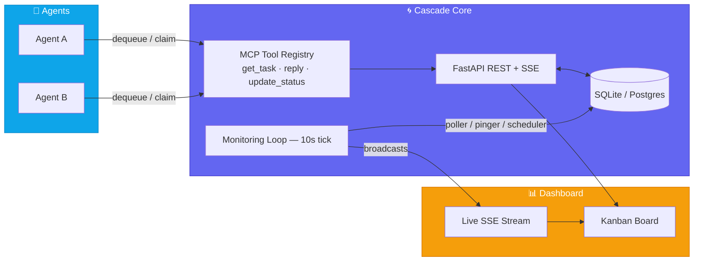
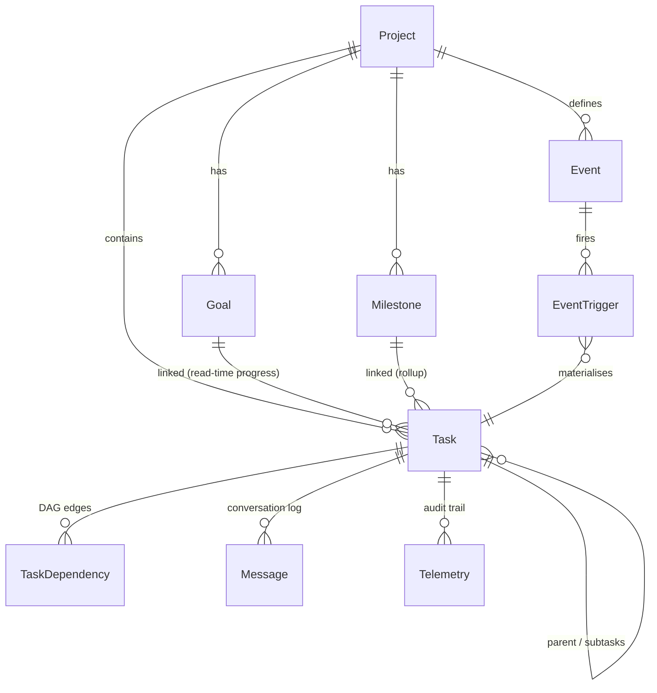

<div align="center">


<a href="https://github.com/nguyenminhduc9988/cascade/actions"></a>
<a href="https://pypi.org/project/cascade-orchestrator/"></a>
<a href="https://www.python.org/downloads/"></a>
<a href="LICENSE"></a>
<a href="https://github.com/nguyenminhduc9988/cascade/stargazers"></a>

<br/>


<br/><br/>

**Cascade** is a from-scratch, production-hardened reimplementation that fuses
[Leantime](https://github.com/Leantime/leantime)'s *strategic coherence*
(task → goal → milestone) with AgentRQ's *agent orchestration* (dequeue,
status state machine, continuous monitoring) — rebuilt in async Python on
FastAPI + SQLAlchemy 2.0, with a live HTMX/SSE dashboard.

[**Quick start**](#-quick-start) · [**Architecture**](#-architecture) · [**MCP tools**](#-mcp-tools) · [**Tests**](#-tests) · [**Contributing**](#-contributing)

</div>

<br/>

## ✨ Why Cascade

<table>
<tr>
<td width="50%" valign="top">

### 🎯 Strategic coherence, not vibes
Every task links explicitly to a `Goal` and `Milestone`. Progress is **never
denormalised** — it's computed at read-time from linked task statuses, so
there's nothing to drift and nothing to repair.

### 🔄 Pull-based, atomically-claimed queue
Agents call `get_task` to dequeue the highest-priority ready task. Claiming
is a single conditional `UPDATE … WHERE status='not_started'` — when two
agents race for the same task, exactly one wins.

### ⏱️ Continuous monitoring, not hourly cron
A 10-second loop runs the poller, pinger and scheduler concurrently — stalled
tasks get nudged, dead agent sessions get evicted, and cron templates spawn
child tasks — all in near real time.

</td>
<td width="50%" valign="top">

### 🤖 Autonomy-first by design
`AutoDecisionService` picks the safest, fastest option itself and only
escalates to a human for genuinely irreversible operations (`delete`,
`drop`, `production-deploy`, …).

### 🔗 Cross-project choreography
`Event` + `EventTrigger` let a task completion in one project silently
materialise a task in another — no polling, no glue code.

### 📡 Real-time everything
Server-Sent Events broadcast every status change, message and agent
heartbeat straight into a dependency-free HTMX dashboard — drag-and-drop
Kanban included.

</td>
</tr>
</table>

<br/>

## 🧱 Tech stack

<div align="center">

| Layer | Choice |
|---|---|
| **Runtime** | Python 3.11+ · FastAPI · Uvicorn |
| **ORM** | SQLAlchemy 2.0 (async, `Mapped[]`) · aiosqlite · WAL mode |
| **Migrations** | Alembic |
| **Schemas** | Pydantic v2 |
| **IDs** | `python-ulid` — time-ordered, sortable |
| **Real-time** | `sse-starlette` + in-memory pub/sub |
| **Scheduling** | croniter (cron-template spawning on the monitoring-loop tick) |
| **UI** | HTMX + Tailwind (CDN, zero build step) |
| **Agent protocol** | Model Context Protocol (MCP) tool registry |

</div>

<br/>

## 🚀 Quick start

```bash
pip install cascade-orchestrator

# launch the API + dashboard
cascade
```

Or from source:

```bash
git clone https://github.com/nguyenminhduc9988/cascade.git
cd cascade
python -m venv venv && source venv/bin/activate
pip install -e ".[dev]"

python -m uvicorn cascade.main:app --reload --port 8100
```

Open **http://localhost:8100** for the live dashboard. Interactive API docs
live at `/docs`, and `/api/health` reports service health.

The database is created automatically on first boot (`init_db`). For managed
schema changes, use Alembic:

```bash
python -m alembic upgrade head
python -m alembic revision --autogenerate -m "describe change"
```

<br/>

## 🏗️ Architecture



### Data model



`Task` is the **unified work item** (polymorphic: epic / story / task /
subtask) — a status state machine, bidirectional human/agent delegation,
self-referential hierarchy, strategic goal/milestone links, cron-template
spawning and event choreography, all in one model.

<br/>

## ⚙️ How it works

<details>
<summary><b>🔄 Dequeue = atomic claim</b></summary>
<br/>

`GET /api/tasks/dequeue?project_id=…&assignee=agent` scans `not_started`
tasks in priority order, checks DAG readiness via `check_dependencies`, and
claims the winner with a single conditional `UPDATE`:

```sql
UPDATE tasks SET status='ongoing' WHERE id=? AND status='not_started'
```

If the row-count is zero, another agent already won — Cascade moves to the
next candidate instead of handing out duplicate work.

</details>

<details>
<summary><b>🧮 Status state machine</b></summary>
<br/>

Every transition funnels through `TaskService.update_status`, validated
against an explicit transition table:

```
not_started → ongoing → completed | blocked | rejected
    blocked → ongoing | rejected | completed
  completed → ongoing | not_started        (reopen)
   rejected → not_started                   (re-queue)
```

Each transition sets `started_at`/`completed_at`, records telemetry, posts a
system message to the task's conversation log, broadcasts an SSE event —
and if the task declares `emit_event_id`, fires that event on completion,
driving cross-project choreography automatically.

</details>

<details>
<summary><b>📈 Goal progress — computed, never stored</b></summary>
<br/>

`GoalService.get_progress` counts linked tasks completed/total live, every
time. There is no `progress_pct` column to fall out of sync — the number you
see is always true.

</details>

<details>
<summary><b>💓 Continuous monitoring loop</b></summary>
<br/>

`engine/loop.monitoring_loop` runs every **10 seconds** (not hourly), firing
the poller, pinger and scheduler concurrently — each on its own database
session, since `AsyncSession` isn't safe to share across coroutines:

- **Poller** — finds `ongoing` tasks with no recent message and nudges them.
- **Pinger** — evicts agent sessions past their heartbeat timeout and
  broadcasts liveness changes.
- **Scheduler** — spawns child tasks from due `cron`-status templates,
  idempotently (never double-spawns while a child is still active).

</details>

<details>
<summary><b>🛡️ Autonomy without recklessness</b></summary>
<br/>

`AutoDecisionService.should_ask_human` returns `True` **only** for
destructive keywords (`delete`, `drop`, `purge`, `production-deploy`,
`force-push`, `refund`, …). Everything else is auto-resolved by
`auto_resolve_choice`, which scores options on risk / effort /
reversibility and picks the safest, fastest one — recording its reasoning
as a message on the task.

</details>

<br/>

## 🤖 MCP tools

Cascade exposes a per-workspace [MCP](https://modelcontextprotocol.io) tool
registry — each server instance is bound to one `project_id` and **force-scopes
every call to it**, so an agent connected to one project can never read or
write another's data.

| Tool | Purpose |
|---|---|
| `get_task` | Dequeue + atomically claim the next ready task, or fetch by ID |
| `create_task` | Decompose / delegate work (`parent_id` + `depends_on`) |
| `reply` | Post progress / reply / permission messages |
| `update_status` | Transition task status through the state machine |
| `get_mission` | Big-picture mission + active goals |
| `get_project_context` | Full project state for strategic coherence |
| `publish_event` | Emit a cross-project choreography event |
| `get_dependencies` | Dependency tree — what a task waits on / blocks |
| `auto_decide` | Auto-resolve a choice without asking a human |

See [`cascade/mcp/instructions.py`](cascade/mcp/instructions.py) for the full
agent operating contract served as the MCP server's system instructions.

<br/>

## 🧪 Tests

```bash
pip install -e ".[dev]"
pytest -q
```

<div align="center">

</div>

39 tests run against an isolated in-memory SQLite database per test (with
`PRAGMA foreign_keys=ON` to match production), covering the status state
machine, DAG dependency resolution, **concurrent dequeue race safety**,
**concurrent status-transition race safety**, cron template spawn integrity,
goal/milestone progress aggregation, cascade-delete referential integrity,
event-trigger choreography, MCP workspace isolation, and the full REST +
HTMX page surface.

<br/>

## 🔧 Configuration

All settings are overridable via `CASCADE_`-prefixed env vars or a `.env`
file (see [`cascade/config.py`](cascade/config.py)):

| Setting | Default |
|---|---|
| `CASCADE_DATABASE_URL` | `sqlite+aiosqlite:///./cascade.db` |
| `CASCADE_PORT` | `8100` |
| `CASCADE_LOOP_TICK_SECONDS` | `10` |
| `CASCADE_STALL_THRESHOLD_MINUTES` | `30` |
| `CASCADE_SESSION_TIMEOUT_SECONDS` | `60` |
| `CASCADE_ENABLE_MONITORING_LOOP` | `true` |
| `CASCADE_ENABLE_SCHEDULER` | `true` |

<br/>

## 🗂️ Project structure

```
cascade/
├── pyproject.toml          # packaging + pytest config
├── alembic/                # async migrations (env.py + versions/)
├── cascade/
│   ├── main.py             # FastAPI app factory + lifespan (monitoring loop)
│   ├── config.py           # Pydantic Settings (CASCADE_ env prefix)
│   ├── database.py         # async engine (WAL + busy_timeout + FK enforcement)
│   ├── models/              # SQLAlchemy 2.0 typed models
│   ├── schemas/              # Pydantic v2 request/response
│   ├── services/            # business logic (thin routers → services)
│   ├── routers/              # REST + SSE + HTMX page handlers
│   ├── mcp/                  # MCP server factory + tools + agent instructions
│   ├── engine/                # monitoring loop, poller, pinger, progress tracker
│   ├── integrations/          # Hermes bridge client + standalone monitor daemon
│   └── web/                   # Jinja2 templates + static app.js
└── tests/                     # pytest-asyncio, 39 tests
```

<br/>

## 🛠️ Contributing

<table>
<tr><td>

1. Fork the repo and create a feature branch
2. Add or update tests for any behaviour change — the suite runs against a
   FK-enforced in-memory database, so referential-integrity bugs get caught
   before they reach production
3. `pytest -q` must pass
4. Open a pull request describing the change and its rationale

</td></tr>
</table>

<br/>

## 📄 License

Released under the **MIT License** — see [`LICENSE`](LICENSE).

Cascade reinterprets ideas from [Leantime](https://github.com/Leantime/leantime)
(strategic task–goal–milestone coherence) and AgentRQ (agent dequeue + status
state machine + monitoring loop), reimplemented from scratch in async Python.
It is an independent work and is not affiliated with or endorsed by either
project.

<br/>

<div align="center">


**⭐ Star this repo if Cascade helps you orchestrate your agents.**

</div>
